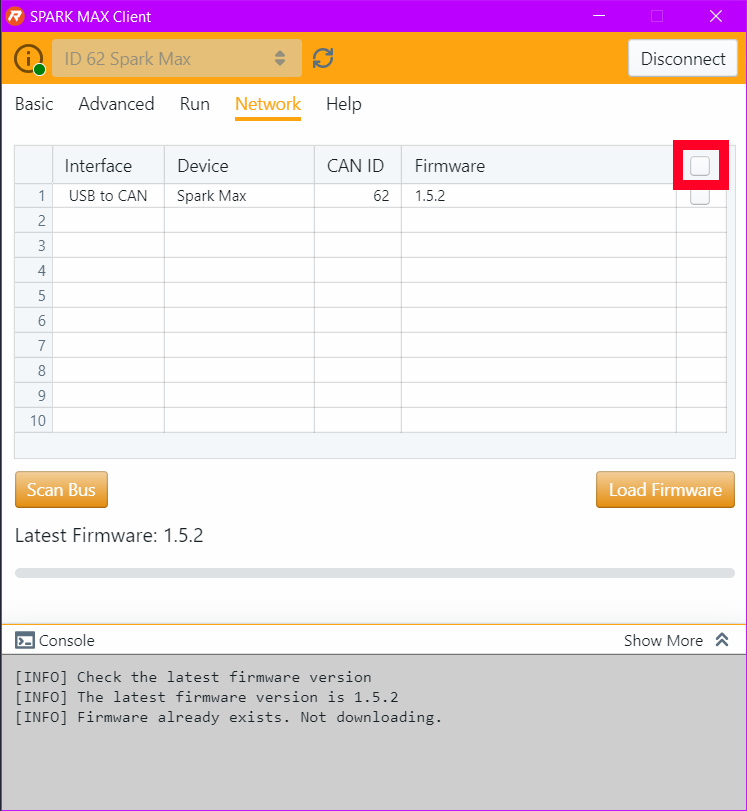
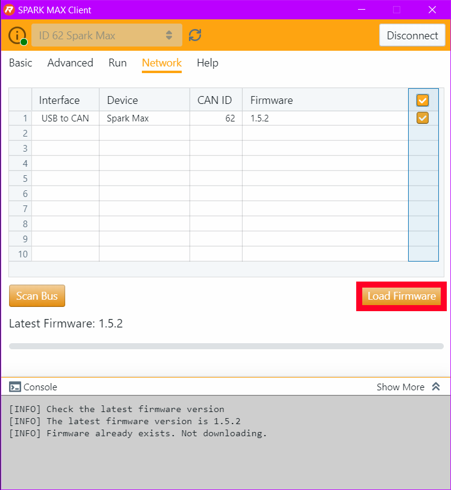
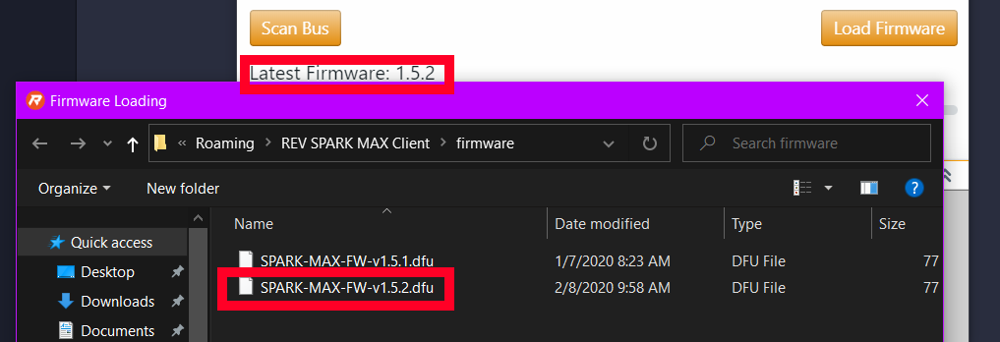
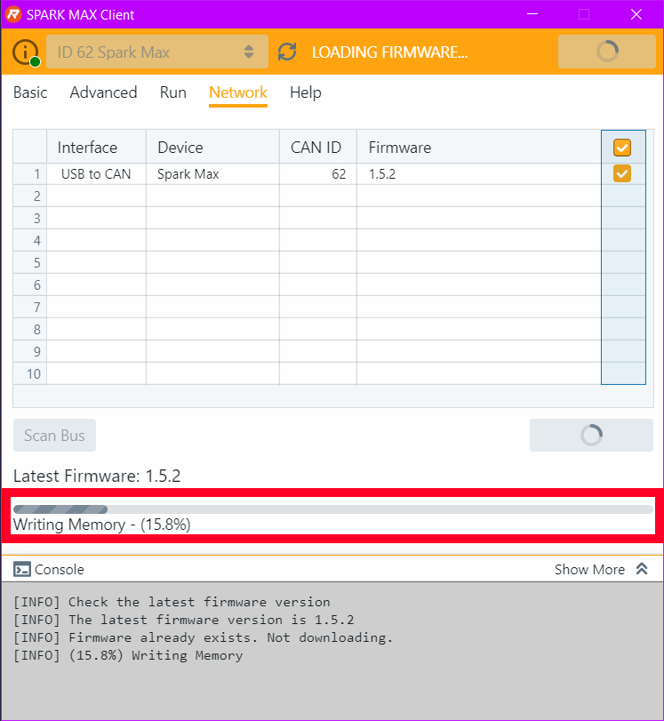
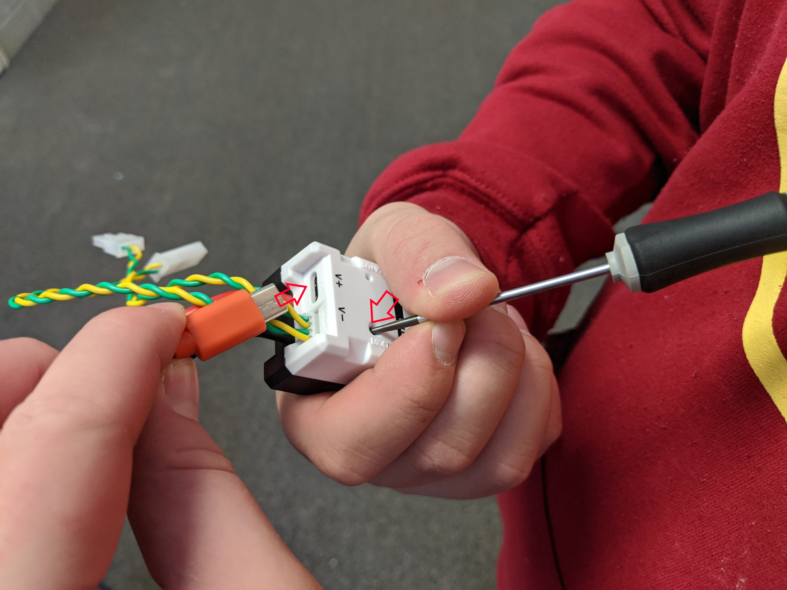
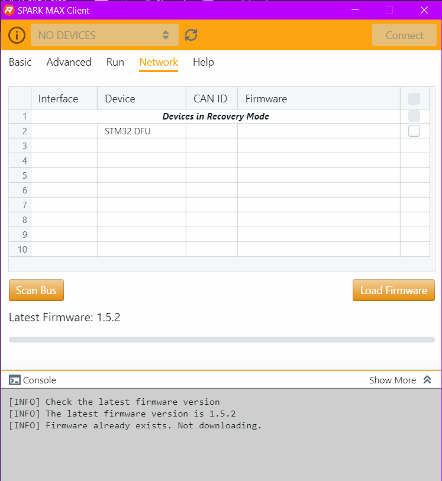
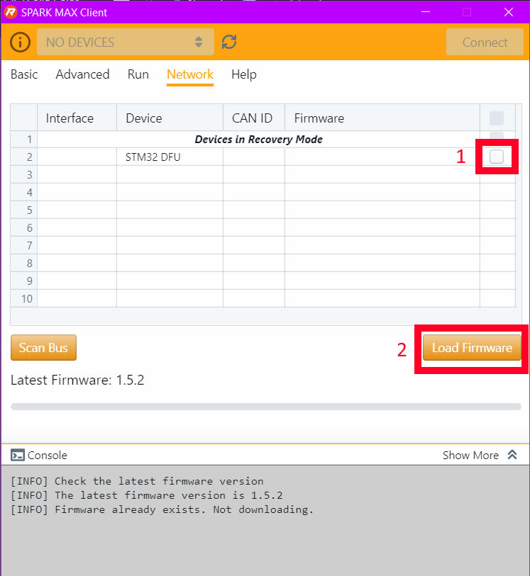

# Updating Spark MAX

Tutorial on how to update the Spark MAX motor controllers

## How to update
First you want to download the [REV Spark MAX Cilent (Latest Version)](http://www.revrobotics.com/sparkmax-software/#spark-max-client-application)

Next, plug the USB-C cable into the Spark Max

Then open the Spark MAX Cilent and click connect.

You may have to update the CAN ID if this is a new Spark MAX.
To do this, click the CAN number, which should be 0 if it's not configured.
Change it to a number that is either one above or one below the highest/lowest ID.
The ID cannot be >62

Go to the "Network" tab and then click "Scan Bus"

Then click the highlighted box to select every Spark MAX connected. If this is on a finished robot, there will be all of the Spark MAX's here.

Click "Load firmware"

Click the latest firmware that corresponds to the display on the client.

Click yes and your firmware should be updating.
### Please wait for this process to finish and do not unplug the USB cable.

After this process is complete, you should have an updated Spark MAX Motor Controller! Make double sure it has the right CAN ID

## Troubleshooting
If this doesn't work check:
- Is your CAN ID under 63?
- Have you tried turning it off and on again? (no seriously, this software is a piece of crap, try it)

If your version on the Spark MAX is too old, you may have to put it into recovery mode, to do this, follow these steps.
### Recovery Mode
First, unplug the Spark MAX.

Grab something small and pointy, like a small screwdriver or a paperclip.

Press the button as shown in the picture. Make sure that it isn't the LED you're pushing on.

Next, while still holding the button down, plug in the USB-C cable.

If you did it right, the LED should **NOT** be on

Go into the Spark MAX cilent again, click on the "Network" tab, it should look like this.

Next, select the Spark MAX that you're having trouble with, and click "Load firmware"

Your Spark MAX should be updated to the latest version! Please configure the CAN ID if necessary. 

!! If there are any issues with this document, please make those changes or open an issue thread.
